<p align="center">
  
</p>

<br>

<h1 align="center">
  
</h1>

<p align="center">
Data Science • Software Engineering • AI Automation
</p>

<br>

<p align="center">
  
</p>

<br>

```python
╔════════════════════════════════════════════════════════════════════════════╗
║                      TANISH_BANDODKAR.exe  v2.0                            ║
╠════════════════════════════════════════════════════════════════════════════╣

tanish = {
    "role"        : "Technology Analyst @ NorthStar Technologies 💼",
    "also"        : "Placement Coordinator @ KJSCE 🎓",
    "education"   : "B.Tech CSBS @ KJ Somaiya College of Engineering 🏫",
    "cgpa"        : 9.45,
    "location"    : "Mumbai, India 🇮🇳  (UTC +5:30)",
    "github"      : "https://github.com/tani-codes 🌐",

    "internships" : [
        "Technology Analyst @ NorthStar Tech  → Software Testing, BA & Data Science Exposure ⚡",
        "Associate Data Analyst @ Furrie      → Data Funnels & n8n Agentic Workflows 🤖",
        "Data Analytics Intern @ KJSCE         → Indian Cricket Team Analytics (2024-25) 🏏",
    ],

    "superpowers" : [
        "Data Analytics & Viz  → Python | Pandas | NumPy | Tableau | Power BI | Matplotlib",
        "AI & Automation       → n8n Workflows | Agentic AI | Web Scraping | Scikit-Learn",
        "Software Engineering  → Manual & Automated Testing | BRD/FRD Requirement Analysis",
        "Business Intelligence → Data Funnels | Market Intelligence | Dashboarding",
    ],

    "experience_highlights" : {
        "NorthStar Tech"     : "Software Testing, UAT, BRDs/FRDs & Analytics Exposure 🏢",
        "Furrie"             : "n8n Agentic Workflows & E-Commerce Data Funnels 📈",
        "Cricket Analytics"  : "Indian Cricket Team All-Format Performance 2024-25 🏆",
        "Academic CGPA"      : "9.45  (Consistent Academic Excellence 🌟)",
    },

    "current_mission" : "Build intelligent AI automation workflows & data-driven systems 🚀",
    "fun_fact"        : "I analyze cricket data for fun & automate workflows with AI 💀",
}

╚════════════════════════════════════════════════════════════════════════════╝
```

<br>
<br>

<h2 align="center">🛠️ TECH ARSENAL</h2>

<br>

<div align="center">

### 🤖 AI AUTOMATION & MACHINE LEARNING
<p align="center">
  <a href="https://python.org" target="_blank"></a>
  <a href="https://n8n.io" target="_blank"></a>
  <a href="https://scikit-learn.org" target="_blank"></a>
  <a href="https://github.com/tani-codes" target="_blank"></a>
  <a href="https://python.org" target="_blank"></a>
</p>

<br>

### 📊 DATA SCIENCE, ANALYTICS & VISUALIZATION
<p align="center">
  <a href="https://pandas.pydata.org" target="_blank"></a>
  <a href="https://tableau.com" target="_blank"></a>
  <a href="https://postgresql.org" target="_blank"></a>
  <a href="https://mysql.com" target="_blank"></a>
</p>
<p align="center">
  <a href="https://pandas.pydata.org" target="_blank"></a>
  <a href="https://numpy.org" target="_blank"></a>
  <a href="https://matplotlib.org" target="_blank"></a>
  <a href="https://powerbi.microsoft.com" target="_blank"></a>
  <a href="https://tableau.com" target="_blank"></a>
  <a href="https://analytics.google.com" target="_blank"></a>
</p>

<br>

### 💻 LANGUAGES & CORE PROGRAMMING
<p align="center">
  <a href="https://python.org" target="_blank"></a>
</p>

<br>

### ⚡ SOFTWARE ENGINEERING & BUSINESS ANALYSIS
<p align="center">
  <a href="https://github.com/tani-codes" target="_blank"></a>
  <a href="https://github.com/tani-codes" target="_blank"></a>
  <a href="https://github.com/tani-codes" target="_blank"></a>
  <a href="https://github.com/tani-codes" target="_blank"></a>
</p>

<br>

### 🎨 FRONTEND & UI FRAMEWORKS
<p align="center">
  <a href="https://react.dev" target="_blank"></a>
</p>

<br>

### 🛠️ DEVELOPER TOOLS & DESIGN
<p align="center">
  <a href="https://git-scm.com" target="_blank"></a>
</p>
<p align="center">
  <a href="https://canva.com" target="_blank"></a>
  <a href="https://colab.research.google.com" target="_blank"></a>
  <a href="https://jupyter.org" target="_blank"></a>
</p>

</div>